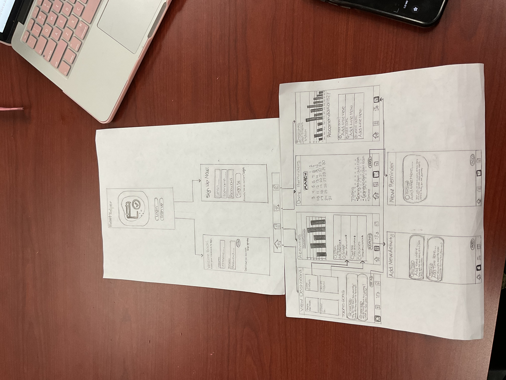
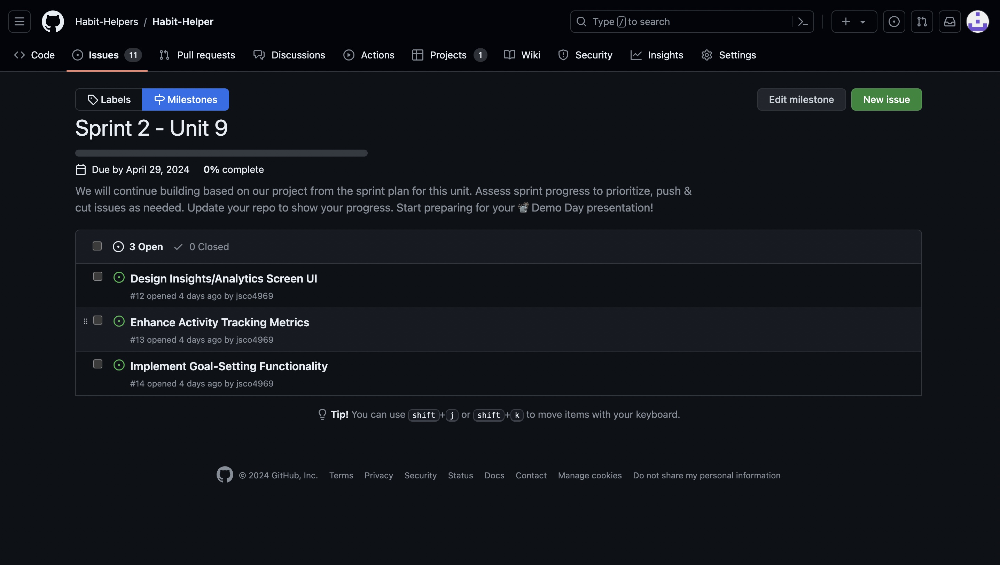

# Habit-Helper# Milestone 1 - Digital Habit Tracker (Unit 7)

## Table of Contents

1. [Overview](#Overview)
1. [Product Spec](#Product-Spec)
1. [Wireframes](#Wireframes)

## Overview

### Description

An app that helps users build and maintain healthy habits by tracking daily activities, setting reminders, and providing insights into behavior patterns to facilitate positive change.

### App Evaluation

- **Category:** Health/Fitness
- **Mobile:** Provides a mobile app for tracking daily habits, setting goals, and monitoring progress on the go. Offers reminders and notifications to keep users on track.
- **Story:** The story revolves around helping users lead healthier and more organized lives by cultivating positive habits. It emphasizes personal growth and self-improvement, which can resonate well with the audience. The value proposition is clear by using the app, users can track their habits, set goals, and receive personalized insights to achieve positive behavioral changes.
- **Market:**
    - Market Size: The market for habit tracking and personal development apps is significant and growing, as more people prioritize wellness and self-improvement.
    - Unique Market Positioning: While the market is competitive, the app  can differentiate itself by offering unique features, user-friendly design, and effective habit-building techniques.
- **Habit:** Users integrate habit tracking into their daily routine, logging activities, and tracking progress towards goals. Regularly review performance metrics and adjust habits accordingly.
- **Scope:**
  -  Technical Challenge: Building a habit tracker involves integrating various functionalities such as activity tracking, reminder notifications, data visualization, and user feedback mechanisms. While technically challenging, it's achievable with modern development tools and frameworks.
  - Stripped-Down Version: Even a basic version of the app, focusing on core features like habit tracking and reminders, would be valuable and interesting to users.
  - Product Definition: The product scope is well-defined, with clear objectives and features aimed at helping users establish and maintain positive habits.

## Product Spec

### 1. User Features (Required and Optional)

**Required Features**

1. Feedback and Insights: Provide personalized feedback and insights based on user data to help users optimize their habits and improve their overall well-being.
2. Habit Tracking: Provide a user-friendly interface for logging daily activities and tracking progress towards goals.
3. Goal Setting: Allow users to set specific goals for habits they want to establish or break.

**Optional Features**

1. Change Theme: Allows the user to change the screen to either Dark or Light mode.
2. Mood Tracking: Include the ability for users to log their mood or emotional state alongside their habit tracking, providing additional context and insights.
3. Gamification Elements: Incorporate gamification elements such as levels, achievements, or virtual rewards to make habit tracking more engaging and enjoyable.

### 2. Screen Archetypes

- Log Screen
  - User can select Login
  - User can select Sign Up
    
- Login Screen
  - User can login to account
    
- Sign Up Screen 
  - User can make an account
    
- Home Screen
  - User can click a section to see data in full
  - Allows user to see summary of all Screens:
    - Activies Screen
    - Reminder Screen
    - Insight Screen
    
- Activites Screen
  - Allow user see activites stats 
 
- Add new activity Screen
  - User can add activities 
    
- Reminder Sceen
  - See daily reminders 
 
- New Reminder Screen
  - User can set reminders
    
- Insight Screen
  - Shows your overall summary of behavior pattern:
    - Daily/Weekley/Monthly trends
    - Habit Streaks
    - Goal Progress
   
- Profile Setting Screen
  - User can edit or update profile 

### 3. Navigation

**Tab Navigation** (Tab to Screen)

* Home 
* Activites
* Reminders
* Insights

**Flow Navigation** (Screen to Screen)

- Login Screnn
  - => Home Screen
  
- Sign Up Screen 
  - => Home Screen 

- Home Screen 
  - => Activity Screen (When clicking an **Activity**)
  - => Insgiht Screen (When you click **See All** button)

- Activities Screen
  - => Add New Activity Screen (When you click **Add Activity** button at bottom of Activities Scren)
  - => Home Screen (After you finish adding activiy you did)
 
- Daily reminder Screen
  - => New Reminder Screen (When you click on **Add** button)
  - => Home Screen (After you finish adding new reminder)
  

## Wireframes

 

 

### [BONUS] Digital Wireframes & Mockups
https://www.figma.com/file/3NHe8AcQinNxbA3hhXfm0V/HabitHelpers?type=design&node-id=0%3A1&mode=design&t=vX1dEZuzPdHmM0IR-1

### [BONUS] Interactive Prototype

 

# Milestone 2 - Build Sprint 1 (Unit 8)

## GitHub Project board

## Issue cards

- [Add screenshot of your Project Board with the issues that you've been working on for this unit's milestone]
 
- [Add screenshot of your Project Board with the issues that you're working on in the **NEXT sprint**. It should include issues for next unit with assigned owners.]
 

## Issues worked on this sprint

- List the issues you completed this sprint:
  - Design Home Screen UI
  - Implement Authentication Login
  - Coding default Screen Functionality
  - Implement Backend Data Storage
  - Design UI for Login and Sign Up Screen
  - Creating android application
 
    
-  *Current build of app*
  
  

 

# Milestone 3 - Build Sprint 2 (Unit 9)

## GitHub Project board

- *Milestone 2* issues worked on.

- *Milestone 3* issues worked on.

- Completed *Project Board* with the issues that We've been working on. 

 

## Completed user stories

- completed *user stories* from this unit
  - Enhance Activity Tracking Metrics
  - Implement Goal-Setting Functionality
  - Design Insight/Analytics Screen UI
    
  

- *App at 75% complete*

- *App 100% Complete*

## App Demo Video

- Embed the YouTube/Vimeo link of your Completed Demo Day prep video
